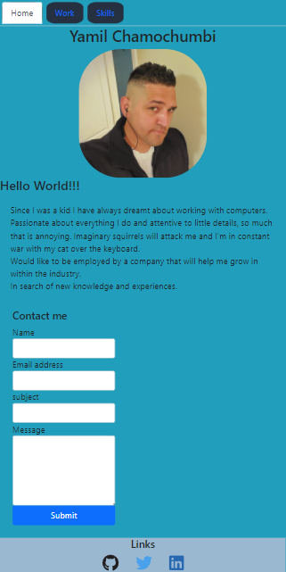

  
# My React Portfolio.
[Link Here!](https://61aaec1d82bd810008661dba--yamchamreact.netlify.app/)

## Description

 To allow visitors to know a little about me and to expose some of my previous works and an opportunity to give some feedback.
 
 
 To experiment with diferent libraries without limits and making it responsive for users on multiple devices.

## Table of Contents (Optional)

- [Installation](#installation)
- [Usage](#usage)
- [Credits](#credits)
- [License](#license)

## License

 MIT

## Badges

 

## How to Contribute

 Contact me and we can discuss projects or exchange ideas.

